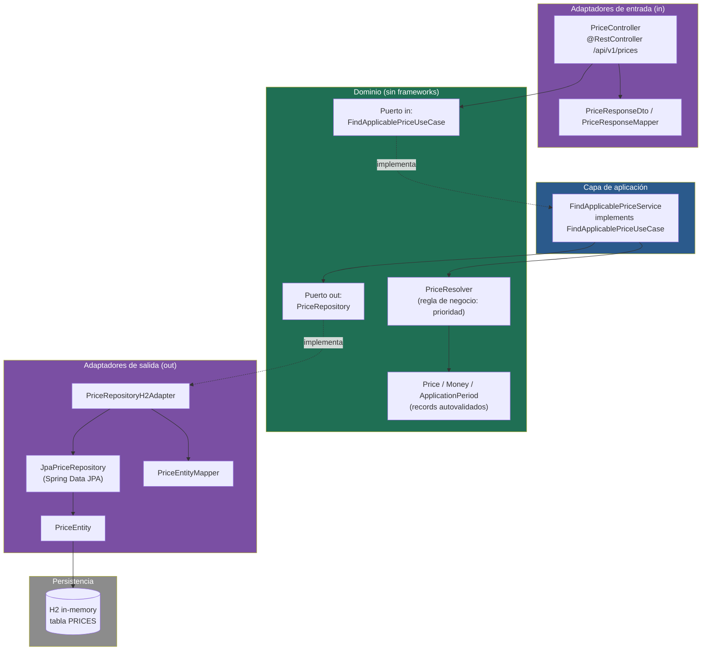
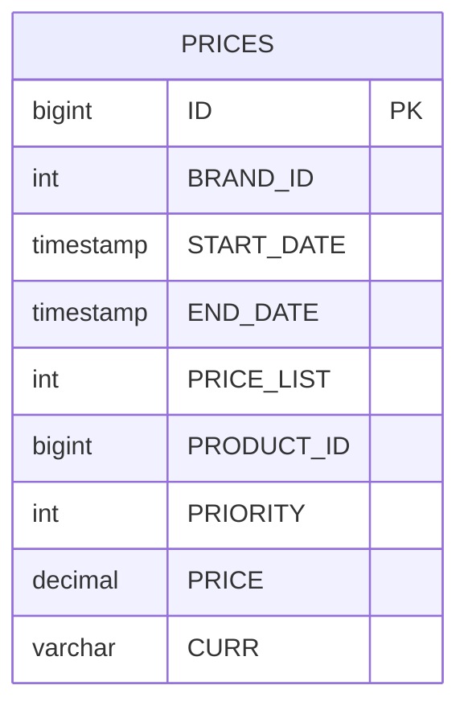
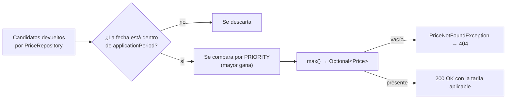
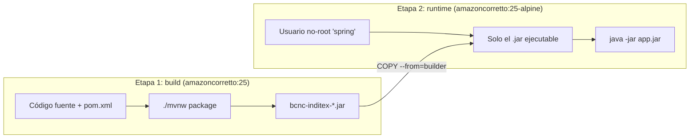
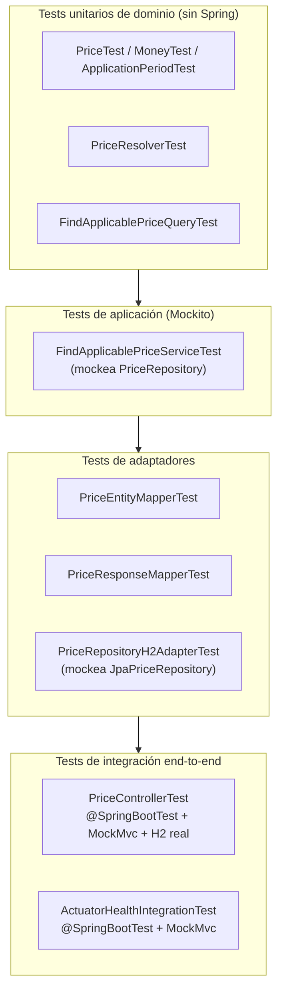

# BCNC Inditex — Prices API

[](https://github.com/emanuelmcp/bcnc-inditex/actions/workflows/ci.yml)

Servicio REST en Spring Boot que resuelve la tarifa de precio aplicable a un
producto de una cadena (brand) en una fecha/hora determinada, a partir de la
tabla `PRICES` del ejemplo de la prueba técnica.

Cuando varias tarifas se solapan en el tiempo para el mismo producto y cadena,
se devuelve la de mayor `PRIORITY` (mayor valor numérico gana).

---

## Índice

1. [Enunciado resuelto](#enunciado-resuelto)
2. [Stack técnico](#stack-técnico)
3. [Arquitectura](#arquitectura)
4. [Modelo de datos](#modelo-de-datos)
5. [Flujo de una petición](#flujo-de-una-petición)
6. [Regla de negocio: resolución de prioridad](#regla-de-negocio-resolución-de-prioridad)
7. [Endpoint REST](#endpoint-rest)
8. [Casos de prueba del enunciado](#casos-de-prueba-del-enunciado)
9. [Cómo ejecutar el proyecto](#cómo-ejecutar-el-proyecto)
10. [Configuración y perfiles](#configuración-y-perfiles)
11. [Base de datos H2](#base-de-datos-h2)
12. [Documentación OpenAPI / Swagger](#documentación-openapi--swagger)
13. [Observabilidad: Actuator](#observabilidad-actuator)
14. [Docker y despliegue](#docker-y-despliegue)
15. [Estrategia de testing](#estrategia-de-testing)
16. [Estructura del proyecto](#estructura-del-proyecto)
17. [Decisiones de diseño](#decisiones-de-diseño)

---

## Enunciado resuelto

- Endpoint REST de consulta que acepta como parámetros de entrada: **fecha de
  aplicación**, **identificador de producto** e **identificador de cadena**.
- Devuelve: identificador de producto, identificador de cadena, tarifa
  aplicada (`PRICE_LIST`), fechas de aplicación (inicio/fin) y precio final.
- Base de datos en memoria H2, inicializada al arrancar con los datos del
  ejemplo (`src/main/resources/data.sql`).
- Tests de integración sobre el endpoint que cubren los 5 casos pedidos en el
  enunciado, más casos adicionales de robustez (404, 400).

## Stack técnico

| Componente               | Detalle                                          |
|----------------------------|----------------------------------------------------|
| Lenguaje                   | Java 25                                             |
| Framework                  | Spring Boot 4.1.1 (`spring-boot-starter-webmvc`)   |
| Persistencia                | Spring Data JPA + Hibernate                         |
| Base de datos               | H2 (en memoria)                                     |
| Documentación API           | springdoc-openapi (Swagger UI)                      |
| Observabilidad              | Spring Boot Actuator                                |
| Testing                     | JUnit 5, Mockito, MockMvc, Spring Boot Test         |
| Build                       | Maven (wrapper incluido, `mvnw`)                    |
| Empaquetado                 | Docker (multi-stage build) + Docker Compose         |
| Reducción de boilerplate    | Lombok                                              |

## Arquitectura

El servicio sigue **arquitectura hexagonal (puertos y adaptadores)**. El
dominio (`price/domain`) no tiene ninguna dependencia de Spring ni de JPA: es
Java puro, testeable de forma aislada. La infraestructura (`price/infra`)
implementa los puertos definidos por el dominio.



Principios aplicados:

- **Inversión de dependencias**: el dominio define los puertos
  (`FindApplicablePriceUseCase`, `PriceRepository`); la infraestructura los
  implementa, nunca al revés.
- **Independencia de framework en el dominio**: `PriceResolver` y
  `FindApplicablePriceService` se instancian como beans manuales en
  `PriceBeanLoader`, no llevan anotaciones de Spring.
- **Value Objects inmutables**: `Price`, `Money` y `ApplicationPeriod` son
  `record` de Java con validación de invariantes en el constructor compacto
  (no puede existir un `Money` con importe negativo, ni un `ApplicationPeriod`
  con `start > end`).

## Modelo de datos



Índice compuesto `(BRAND_ID, PRODUCT_ID, START_DATE, END_DATE)` para que el
filtrado por cadena/producto/rango de fechas se resuelva a nivel de base de
datos y no traiga a memoria más filas de las necesarias.

## Flujo de una petición

```mermaid
sequenceDiagram
    actor Client
    participant Controller as PriceController
    participant Service as FindApplicablePriceService
    participant Resolver as PriceResolver
    participant Repo as PriceRepositoryH2Adapter
    participant DB as H2 (tabla PRICES)

    Client->>Controller: GET /api/v1/prices?applicationDate&productId&brandId
    Controller->>Service: findApplicablePrice(query)
    Service->>Repo: findCandidates(brandId, productId, applicationDate)
    Repo->>DB: SELECT ... WHERE brand_id=? AND product_id=?<br/>AND start_date<=? AND end_date>=?
    DB-->>Repo: filas candidatas (ya acotadas por índice)
    Repo-->>Service: List&lt;Price&gt; (mapeadas a dominio)
    Service->>Resolver: resolveApplicablePrice(fecha, candidatos)
    Resolver-->>Service: Optional&lt;Price&gt; (mayor PRIORITY)
    alt precio encontrado
        Service-->>Controller: Price
        Controller-->>Client: 200 OK + PriceResponseDto
    else no aplica ninguna tarifa
        Service-->>Controller: throw PriceNotFoundException
        Controller-->>Client: 404 Not Found + UnifiedErrorResponseDto
    end
```

## Regla de negocio: resolución de prioridad

La base de datos acota candidatos por eficiencia, pero **la decisión de
negocio final la toma siempre el dominio**, sin confiar ciegamente en el
filtrado de persistencia:



## Endpoint REST

```
GET /api/v1/prices?applicationDate={ISO_LOCAL_DATE_TIME}&productId={long}&brandId={int}
```

**Parámetros de entrada**

| Parámetro        | Tipo             | Obligatorio | Ejemplo               |
|-------------------|------------------|:-----------:|------------------------|
| `applicationDate` | `LocalDateTime`  | Sí          | `2020-06-14T16:00:00` |
| `productId`       | `Long`           | Sí          | `35455`               |
| `brandId`         | `Integer`        | Sí          | `1`                   |

**Respuesta 200 OK**

```json
{
  "productId": 35455,
  "brandId": 1,
  "priceList": 2,
  "startDate": "2020-06-14T15:00:00",
  "endDate": "2020-06-14T18:30:00",
  "price": 25.45,
  "currency": "EUR"
}
```

**Respuestas de error** (formato unificado `UnifiedErrorResponseDto`)

| Código | Motivo                                              |
|--------|------------------------------------------------------|
| 400    | Falta un parámetro obligatorio o tiene un tipo inválido |
| 404    | No existe ninguna tarifa aplicable para esos parámetros |
| 500    | Error interno no controlado                          |

## Casos de prueba del enunciado

Todos verificados sobre el producto `35455`, cadena `1` (ZARA):

| # | Fecha/hora consultada     | Tarifa esperada (`PRICE_LIST`) | Precio  |
|---|-----------------------------|:-------------------------------:|---------|
| 1 | 2020-06-14 10:00            | 1                               | 35.50 € |
| 2 | 2020-06-14 16:00            | 2                               | 25.45 € |
| 3 | 2020-06-14 21:00            | 1                               | 35.50 € |
| 4 | 2020-06-15 10:00            | 3                               | 30.50 € |
| 5 | 2020-06-16 21:00            | 4                               | 38.95 € |

Implementados como tests de integración en
`PriceControllerIntegrationTest` y replicados como tests unitarios de dominio en
`PriceResolverTest` (sin levantar contexto de Spring ni base de datos).

## Cómo ejecutar el proyecto

Requiere JDK 25.

```bash
./mvnw spring-boot:run
```

La aplicación arranca en `http://localhost:8080`. Ejemplo de consulta:

```bash
curl "http://localhost:8080/api/v1/prices?applicationDate=2020-06-14T16:00:00&productId=35455&brandId=1"
```

Ejecutar la suite de tests:

```bash
./mvnw test
```

## Configuración y perfiles

La configuración está separada por entorno siguiendo un principio: **la
configuración base es la segura, y los perfiles suman comodidades**. De este
modo "producción" es sencillamente *sin perfil*, y un despliegue que olvide
configurarlo falla hacia el lado seguro en lugar de exponer de más.

| Fichero | Ámbito | Qué aporta |
|---|---|---|
| `src/main/resources/application.yaml` | Base (= producción) | Consola H2, Swagger y detalle de health **desactivados**; datasource externalizado |
| `src/main/resources/application-dev.yaml` | Perfil `dev` | Consola H2, Swagger UI, `show-sql`, health con detalle y logging DEBUG |
| `src/test/resources/application-test.yaml` | Perfil `test` | Base de datos propia (`bcnc-test-db`) y salida SQL silenciada |

### Quién activa cada perfil

El artefacto no lleva ningún perfil por defecto: lo declara quien lo arranca.

| Forma de arrancar | Perfil activo | Dónde se declara |
|---|---|---|
| `./mvnw spring-boot:run` | `dev` | `<profiles>` del `spring-boot-maven-plugin` (`pom.xml`) |
| `docker compose up` | `dev` | `SPRING_PROFILES_ACTIVE` en `docker-compose.yml` |
| `java -jar target/*.jar` | ninguno -> base | — (comportamiento endurecido) |
| `./mvnw test` | `test` | `@ActiveProfiles("test")` en las clases de test |

Esto es deliberado: el perfil de desarrollo vive en la **herramienta** que
lanza la aplicación, nunca dentro del artefacto empaquetado. La misma imagen
Docker desplegada sin `SPRING_PROFILES_ACTIVE` arranca endurecida.

Para un caso puntual:

```bash
java -jar target/bcnc-inditex-0.0.1-SNAPSHOT.jar --spring.profiles.active=dev
```

### Qué cambia según el perfil

| | Base (sin perfil) | `dev` |
|---|:---:|:---:|
| `GET /api/v1/prices` | 200 | 200 |
| `GET /actuator/health` | 200 (sin detalle) | 200 (con componentes) |
| Swagger UI y `/v3/api-docs` | 404 | 200 |
| Consola H2 en `/h2` | 404 | disponible |
| `show-sql` de Hibernate | desactivado | activado |

El endpoint de negocio responde igual en ambos casos: lo que cambia es la
superficie de exposición auxiliar, no la funcionalidad.

### Configuración externalizada

El datasource no está cableado: se resuelve por variables de entorno, con el
valor por defecto que pide el enunciado (H2 en memoria).

```yaml
spring:
  datasource:
    url: ${DB_URL:jdbc:h2:mem:bcnc-db}
    username: ${DB_USERNAME:sa}
    password: ${DB_PASSWORD:}
    driver-class-name: ${DB_DRIVER:org.h2.Driver}
```

Apuntar el servicio a otro motor (PostgreSQL, por ejemplo) es un cambio de
configuración, no de código. Es coherente con la arquitectura hexagonal: el
adaptador de salida habla JPA, no H2.

Además, `spring.jpa.open-in-view` está explícitamente a `false`. Es lo
correcto en una API REST —no hay renderizado de vistas que necesite la sesión
de persistencia abierta— y elimina el aviso que Spring Boot emite al arrancar.

## Base de datos H2

- Consola web: `http://localhost:8080/h2`
- URL JDBC: `jdbc:h2:mem:bcnc-db`
- Usuario: `sa` — Password: *(vacío)*
- El esquema se crea con `ddl-auto: create-drop` y se puebla automáticamente
  con `data.sql` en cada arranque (`spring.sql.init.mode=always`,
  `defer-datasource-initialization=true` para que se ejecute después de que
  Hibernate cree las tablas).

## Documentación OpenAPI / Swagger

- Swagger UI: `http://localhost:8080/swagger-ui.html`
- Especificación OpenAPI: `http://localhost:8080/v3/api-docs`

## Observabilidad: Actuator

El proyecto expone Spring Boot Actuator para monitorización básica del
servicio:

| Endpoint                    | Descripción                                    |
|-------------------------------|---------------------------------------------------|
| `GET /actuator/health`        | Estado de la aplicación y de sus componentes (incluye el estado de la conexión a H2) |
| `GET /actuator/info`          | Metadatos estáticos de la aplicación (nombre, descripción) |

Configuración relevante en `application.yaml`:

```yaml
management:
  endpoints:
    web:
      exposure:
        include: health, info
  endpoint:
    health:
      show-details: always
```

> **Nota**: los endpoints de Actuator quedan fuera del prefijo `/api`, ya que
> `ApiConfig` solo aplica ese prefijo a clases anotadas con `@RestController`,
> y Actuator registra sus endpoints por su propio mecanismo de
> autoconfiguración. Esto es intencional y es la práctica habitual: los
> health checks de orquestadores (Docker, Kubernetes) y de balanceadores de
> carga esperan encontrarlos en una ruta estable y separada de la API de
> negocio.

Cubierto por test de integración en `ActuatorHealthIntegrationTest`, que
verifica que `status` es `UP` a nivel global y que el componente `db`
(la conexión a H2) también reporta `UP`.

## Docker y despliegue

El proyecto incluye una imagen Docker de dos etapas (*multi-stage build*)
para minimizar el tamaño final de la imagen y no distribuir el JDK completo
ni el código fuente en producción.



**Ficheros de empaquetado**

- `Dockerfile` → Dockerfile multi-stage del proyecto.
- `docker-compose.yml` → orquesta la construcción y el arranque del
  contenedor.

Características del Dockerfile:

- **Build multi-stage**: la etapa de compilación usa `amazoncorretto:25`
  completo (incluye JDK + Maven vía `mvnw`); la etapa final usa
  `amazoncorretto:25-alpine`, mucho más ligera, y solo contiene el `.jar`
  final.
- **Usuario no-root** (`spring`) para ejecutar la aplicación dentro del
  contenedor, siguiendo buenas prácticas de seguridad.
- **`HEALTHCHECK` nativo de Docker** apuntando a `/actuator/health`, de forma
  que `docker ps` y `docker compose` puedan reportar el estado real del
  servicio, no solo si el proceso sigue vivo.
- **`JAVA_OPTS` configurable** por variable de entorno, para poder ajustar
  memoria (`-Xms`/`-Xmx`) sin reconstruir la imagen.

Uso:

```bash
docker compose up --build
```

La aplicación queda expuesta en `http://localhost:8080` igual que en local,
incluyendo Swagger UI, la consola H2 y `/actuator/health`.

> Como la base de datos es H2 en memoria (requisito del enunciado), los datos
> se reinicializan desde `data.sql` cada vez que se reinicia el contenedor —
> es el comportamiento esperado y buscado, no una limitación del empaquetado.

## Estrategia de testing



La lógica de negocio (resolución de prioridad, invariantes de los Value
Objects) está cubierta por tests unitarios puros que no dependen de Spring ni
de una base de datos; el comportamiento HTTP observable end-to-end —
incluyendo el health check— está cubierto por tests de integración con
`MockMvc`.

## Estructura del proyecto

```
src/main/java/io/github/emanuelmcp/bcnc_inditex/
├── config/                      # Configuración transversal (prefijo /api, OpenAPI)
├── exception/                   # Manejo de errores unificado (@RestControllerAdvice)
└── price/
    ├── domain/
    │   ├── model/                # Price, Money, ApplicationPeriod
    │   ├── port/in/               # FindApplicablePriceUseCase, FindApplicablePriceQuery
    │   ├── port/out/              # PriceRepository
    │   ├── service/               # PriceResolver
    │   └── exception/             # PriceNotFoundException
    ├── application/               # FindApplicablePriceService
    └── infra/
        ├── adapters/in/           # PriceController + DTOs
        ├── adapters/out/          # JPA entity, repository, adapter H2
        └── config/                # PriceBeanLoader (wiring manual del dominio)

Dockerfile             # Imagen Docker multi-stage
docker-compose.yml     # Orquestación local del contenedor
```

## Decisiones de diseño

- **Doble validación de fechas (BD + dominio)**: la consulta JPA acota por
  rango de fechas usando el índice compuesto (eficiencia), pero
  `PriceResolver` vuelve a validar `isApplicableOn` en memoria. Así el
  dominio no depende de que el adaptador de persistencia filtre
  correctamente; la regla de negocio es autocontenida y se puede testear sin
  base de datos.
- **`Money` normaliza la escala del `BigDecimal` en su constructor
  compacto** (`setScale(2, RoundingMode.UNNECESSARY)`), evitando el clásico
  problema de `BigDecimal.equals()` siendo sensible a la escala
  (`10.0` ≠ `10.00` con `equals()`, pero sí son el mismo importe de negocio).
- **Un único resultado garantizado por construcción**: `PriceResolver` usa
  `Stream.max(...)` sobre el comparador de prioridad, que devuelve como mucho
  un `Optional<Price>`; nunca puede haber ambigüedad en la respuesta.
- **Beans de dominio cableados manualmente** (`PriceBeanLoader`) en lugar de
  `@Service`/`@Component` sobre las clases de dominio, para que el paquete
  `domain` no tenga ninguna dependencia de Spring.
- **Actuator separado de `/api`**: los endpoints de monitorización no
  comparten prefijo con la API de negocio, para que orquestadores y
  balanceadores puedan apuntar a una ruta de health check estable e
  independiente de futuras versiones de la API (`/api/v2/...`, etc.).
