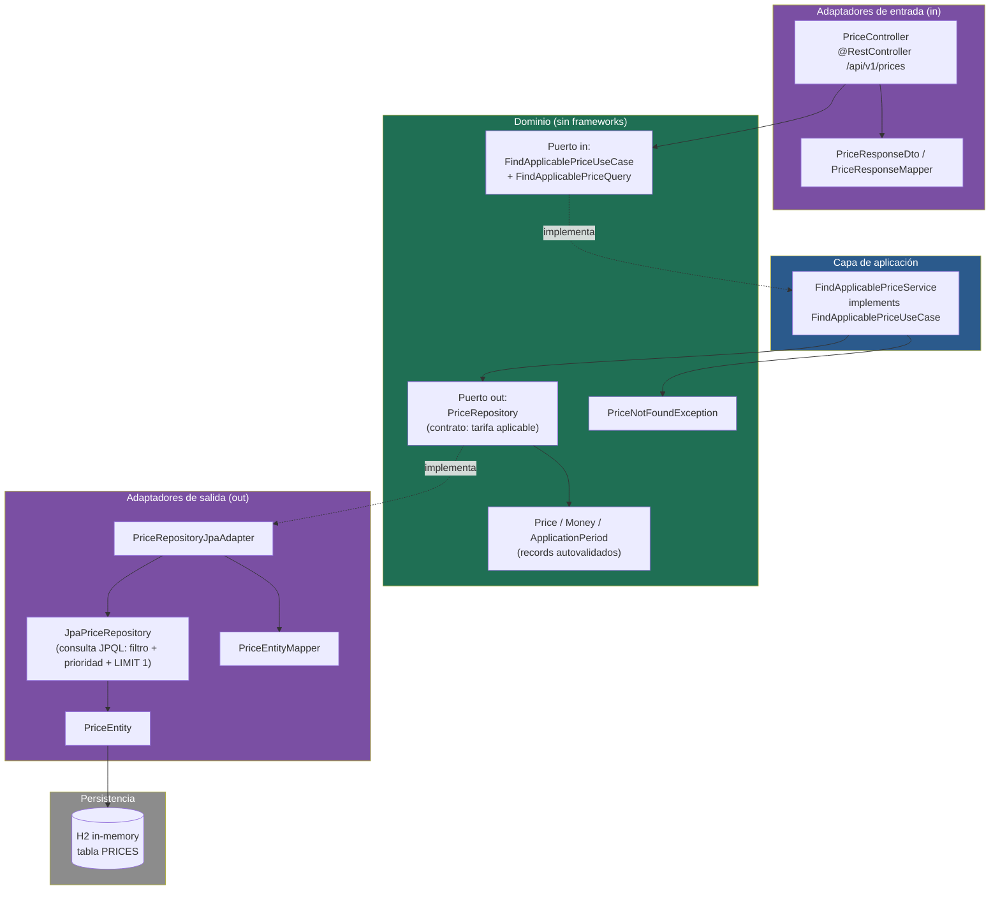
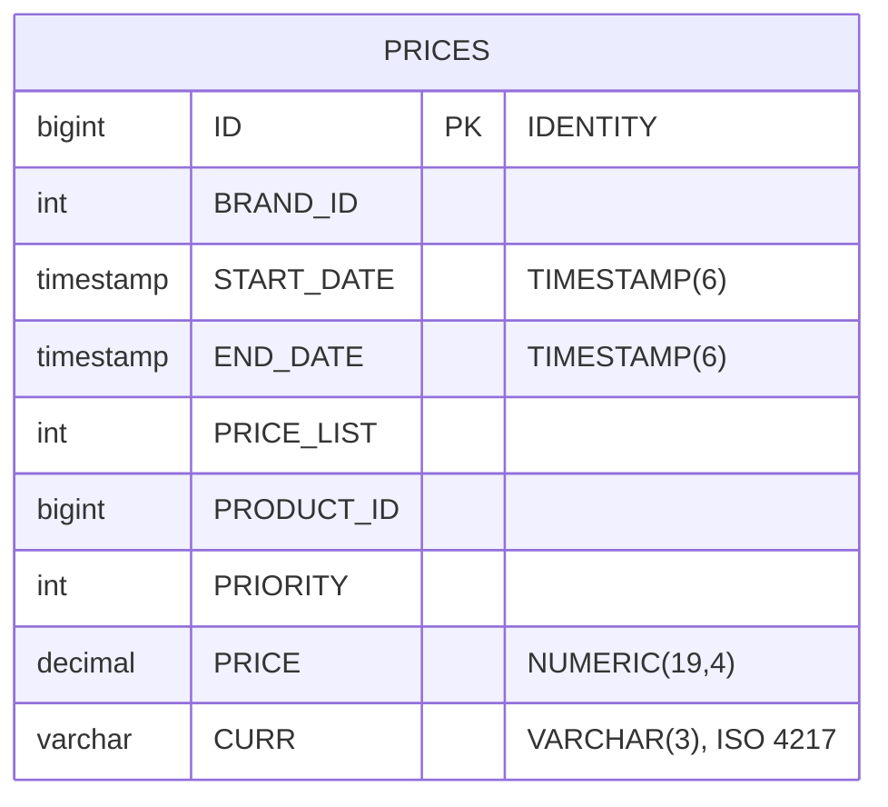
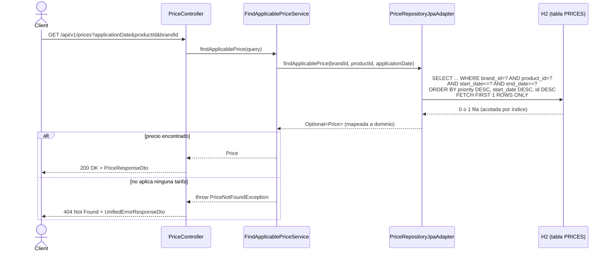
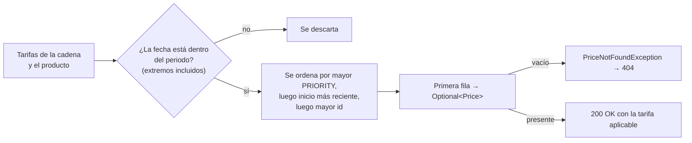
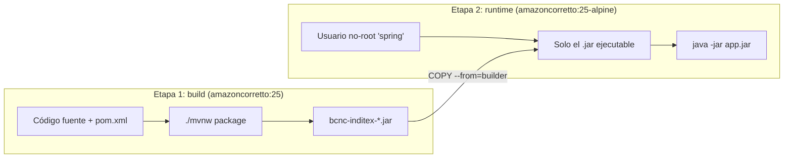
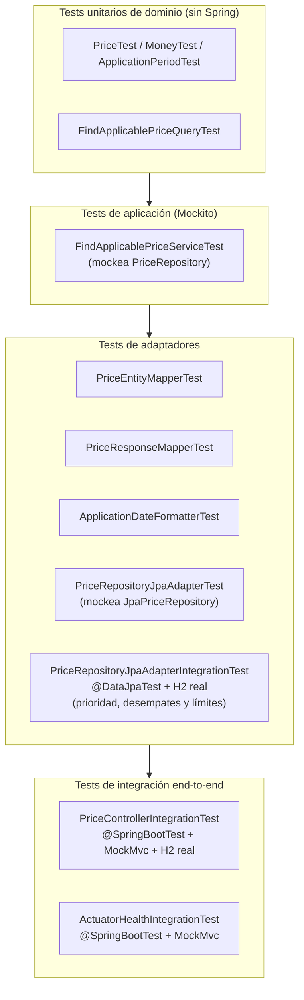

# BCNC Inditex — Prices API

[](https://github.com/emanuelmcp/bcnc-inditex/actions/workflows/ci.yml)

Servicio REST en Spring Boot que resuelve la tarifa de precio aplicable a un
producto de una cadena (brand) en una fecha/hora determinada, a partir de la
tabla `PRICES` del ejemplo de la prueba técnica.

Cuando varias tarifas se solapan en el tiempo para el mismo producto y cadena,
se devuelve la de mayor `PRIORITY` (mayor valor numérico gana).

---

## Índice

1. [Enunciado resuelto](#enunciado-resuelto)
2. [Stack técnico](#stack-técnico)
3. [Arquitectura](#arquitectura)
4. [Modelo de datos](#modelo-de-datos)
5. [Flujo de una petición](#flujo-de-una-petición)
6. [Regla de negocio: resolución de prioridad](#regla-de-negocio-resolución-de-prioridad)
7. [Endpoint REST](#endpoint-rest)
8. [Casos de prueba del enunciado](#casos-de-prueba-del-enunciado)
9. [Cómo ejecutar el proyecto](#cómo-ejecutar-el-proyecto)
10. [Configuración y perfiles](#configuración-y-perfiles)
11. [Base de datos H2](#base-de-datos-h2)
12. [Documentación OpenAPI / Swagger](#documentación-openapi--swagger)
13. [Observabilidad: Actuator](#observabilidad-actuator)
14. [Docker y despliegue](#docker-y-despliegue)
15. [Estrategia de testing](#estrategia-de-testing)
16. [Estructura del proyecto](#estructura-del-proyecto)
17. [Decisiones de diseño](#decisiones-de-diseño)

---

## Enunciado resuelto

- Endpoint REST de consulta que acepta como parámetros de entrada: **fecha de
  aplicación**, **identificador de producto** e **identificador de cadena**.
- Devuelve: identificador de producto, identificador de cadena, tarifa
  aplicada (`PRICE_LIST`), fechas de aplicación (inicio/fin) y precio final.
- Base de datos en memoria H2, inicializada al arrancar con los datos del
  ejemplo (`src/main/resources/data.sql`).
- Tests de integración sobre el endpoint que cubren los 5 casos pedidos en el
  enunciado, más casos adicionales de robustez (400, 404, 405, 406), de límites
  de los periodos y de filtrado por cadena y producto.

## Stack técnico

| Componente               | Detalle                                          |
|----------------------------|----------------------------------------------------|
| Lenguaje                   | Java 25                                             |
| Framework                  | Spring Boot 4.1.1 (`spring-boot-starter-webmvc`)   |
| Persistencia                | Spring Data JPA + Hibernate                         |
| Base de datos               | H2 (en memoria)                                     |
| Documentación API           | springdoc-openapi (Swagger UI)                      |
| Observabilidad              | Spring Boot Actuator                                |
| Testing                     | JUnit 6, Mockito, MockMvc, Spring Boot Test         |
| Build                       | Maven (wrapper incluido, `mvnw`)                    |
| Empaquetado                 | Docker (multi-stage build) + Docker Compose         |
| Reducción de boilerplate    | Lombok                                              |

## Arquitectura

El servicio sigue **arquitectura hexagonal (puertos y adaptadores)**. El
dominio (`price/domain`) no tiene ninguna dependencia de Spring ni de JPA: es
Java puro, testeable de forma aislada; su única dependencia es `common/domain`,
también Java puro. La infraestructura (`price/infra`)
implementa los puertos definidos por el dominio.



Principios aplicados:

- **Inversión de dependencias**: el dominio define los puertos
  (`FindApplicablePriceUseCase`, `PriceRepository`); la infraestructura los
  implementa, nunca al revés.
- **Independencia de framework en dominio y aplicación**: ni `price/domain` ni
  `price/application` dependen de Spring. `FindApplicablePriceService` no lleva
  anotaciones y se registra como bean de forma manual en `PriceConfiguration`.
- **Value Objects inmutables**: `Price`, `Money` y `ApplicationPeriod` son
  `record` de Java con validación de invariantes en el constructor compacto:
  no puede existir un `Money` con importe negativo o con más decimales de los
  que admite su divisa, un `ApplicationPeriod` con `start > end` ni un `Price`
  con prioridad negativa.
- **Consulta de entrada autovalidada**: `FindApplicablePriceQuery` es también
  un `record`; exige los tres parámetros y trunca la fecha a segundos.

## Modelo de datos



El esquema lo genera Hibernate a partir de `PriceEntity`
(`ddl-auto: create-drop`); no hay `schema.sql`. Todas las columnas son
`NOT NULL` y no hay restricciones `CHECK`: los invariantes (prioridad no
negativa, periodo coherente, divisa válida y sus decimales) los garantiza el
dominio al mapear la fila (ver [Decisiones de diseño](#decisiones-de-diseño)).

Índice compuesto `(BRAND_ID, PRODUCT_ID, START_DATE, END_DATE)` para que la
consulta de la tarifa aplicable filtre por cadena, producto y rango de fechas
sobre el índice (comprobado con `EXPLAIN` en H2) y la base de datos devuelva
una única fila.

## Flujo de una petición



## Regla de negocio: resolución de prioridad

La regla está expresada en el puerto de salida
`PriceRepository.findApplicablePrice(brandId, productId, applicationDate)`:
"la tarifa aplicable a ese producto de esa cadena en esa fecha". El adaptador
JPA la resuelve en una única consulta, de modo que la base de datos devuelve
como mucho una fila:

```sql
SELECT p FROM PriceEntity p
WHERE p.brandId = :brandId
  AND p.productId = :productId
  AND p.startDate <= :applicationDate
  AND p.endDate >= :applicationDate
ORDER BY p.priority DESC, p.startDate DESC, p.id DESC
LIMIT 1
```



Los extremos del periodo (`START_DATE` y `END_DATE`) pertenecen a la tarifa,
con precisión de segundos. El criterio de desempate cuando coinciden las
prioridades es un supuesto propio, ya que el enunciado no lo define (ver
[Decisiones de diseño](#decisiones-de-diseño)).

## Endpoint REST

```
GET /api/v1/prices?applicationDate={yyyy-MM-dd'T'HH:mm:ss}&productId={long}&brandId={int}
```

**Parámetros de entrada**

| Parámetro        | Tipo             | Obligatorio | Ejemplo               |
|-------------------|------------------|:-----------:|------------------------|
| `applicationDate` | `LocalDateTime` (exactamente `yyyy-MM-dd'T'HH:mm:ss`: sin fracciones de segundo ni zona horaria) | Sí | `2020-06-14T16:00:00` |
| `productId`       | `Long` positivo  | Sí          | `35455`               |
| `brandId`         | `Integer` positivo | Sí        | `1`                   |

> **Supuesto sobre la zona horaria**: la tabla `PRICES` guarda las fechas sin
> zona horaria, así que `applicationDate` se interpreta en esa misma hora local.
> Si la fecha llega con zona (`Z`, `+02:00`…), se responde `400` en lugar de
> ignorarla, porque el precio aplicable podría ser otro.

**Respuesta 200 OK**

```json
{
  "productId": 35455,
  "brandId": 1,
  "priceList": 2,
  "startDate": "2020-06-14T15:00:00",
  "endDate": "2020-06-14T18:30:00",
  "price": 25.45,
  "currency": "EUR"
}
```

**Respuestas de error** (formato unificado `UnifiedErrorResponseDto`, siempre en JSON)

| Código | Motivo                                              |
|--------|------------------------------------------------------|
| 400    | Falta un parámetro obligatorio (o llega vacío), tiene un tipo inválido, la fecha no sigue exactamente `yyyy-MM-dd'T'HH:mm:ss` (fracciones de segundo, zona horaria…) o no existe (`2020-02-30T16:00:00`), o `productId`/`brandId` no es positivo |
| 404    | No existe ninguna tarifa aplicable para esos parámetros, o la ruta no existe |
| 405    | Método distinto de `GET` (con cabecera `Allow`) |
| 406    | El cliente no acepta JSON (`Accept`); el error se devuelve igualmente en JSON |
| 500    | Error interno no controlado, incluida una tarifa aplicable que viole los invariantes del dominio (ver [Decisiones de diseño](#decisiones-de-diseño)) |

Ejemplo de error (`404`):

```json
{
  "timestamp": "2026-09-12T10:15:30",
  "status": 404,
  "error": "Not Found",
  "message": "No applicable price found for product 35455, brand 1 at date 2019-01-01T10:00",
  "path": "/api/v1/prices"
}
```

## Casos de prueba del enunciado

Todos verificados sobre el producto `35455`, cadena `1` (ZARA):

| # | Fecha/hora consultada     | Tarifa esperada (`PRICE_LIST`) | Precio  |
|---|-----------------------------|:-------------------------------:|---------|
| 1 | 2020-06-14 10:00            | 1                               | 35.50 € |
| 2 | 2020-06-14 16:00            | 2                               | 25.45 € |
| 3 | 2020-06-14 21:00            | 1                               | 35.50 € |
| 4 | 2020-06-15 10:00            | 3                               | 30.50 € |
| 5 | 2020-06-16 21:00            | 4                               | 38.95 € |

Implementados como tests de integración end-to-end en
`PriceControllerIntegrationTest` (MockMvc + H2 con `data.sql`) y replicados a
nivel de persistencia en `PriceRepositoryJpaAdapterIntegrationTest`
(`@DataJpaTest` contra H2, sin capa web).

## Cómo ejecutar el proyecto

Requiere JDK 25.

```bash
./mvnw spring-boot:run
```

Arranca con el perfil `dev` activo (lo declara el `spring-boot-maven-plugin`
en el `pom.xml`), que habilita Swagger UI y la consola H2. Ver
[Configuración y perfiles](#configuración-y-perfiles).

La aplicación arranca en `http://localhost:8080`. Ejemplo de consulta:

```bash
curl "http://localhost:8080/api/v1/prices?applicationDate=2020-06-14T16:00:00&productId=35455&brandId=1"
```

Ejecutar la suite de tests:

```bash
./mvnw test
```

## Configuración y perfiles

La configuración está separada por entorno siguiendo un principio: **la
configuración sin perfil es la endurecida, y los perfiles suman comodidades**.
Así, un arranque que olvide activar un perfil falla hacia el lado seguro en
lugar de exponer de más.

| Fichero | Ámbito | Qué aporta |
|---|---|---|
| `src/main/resources/application.yaml` | Base (sin perfil) | H2 en memoria con los datos del enunciado; consola H2, Swagger e `info` **desactivados**; health sin detalle |
| `src/main/resources/application-dev.yaml` | Perfil `dev` | Consola H2 (solo desde `localhost`), Swagger UI, `info`, health con detalle, `show-sql` y logging DEBUG |
| `src/test/resources/application-test.yaml` | Perfil `test` | Base de datos propia (`bcnc-test-db`) cargada con `data.sql` + `test-prices.sql`, SQL silenciado y health con detalle (lo necesita `ActuatorHealthIntegrationTest`) |

### Quién activa cada perfil

El artefacto no lleva ningún perfil por defecto: lo declara quien lo arranca.

| Forma de arrancar | Perfil activo | Dónde se declara |
|---|---|---|
| `./mvnw spring-boot:run` | `dev` | `<profiles>` del `spring-boot-maven-plugin` (`pom.xml`) |
| `docker compose up` | `dev` | `SPRING_PROFILES_ACTIVE` en `docker-compose.yml` |
| `java -jar target/*.jar` | ninguno → base | — (comportamiento endurecido) |
| `./mvnw test` | `test` | `@ActiveProfiles("test")` en las clases de test |

Esto es deliberado: el perfil de desarrollo vive en la **herramienta** que
lanza la aplicación, nunca dentro del artefacto empaquetado. La misma imagen
Docker desplegada sin `SPRING_PROFILES_ACTIVE` arranca endurecida.

Para un caso puntual:

```bash
java -jar target/bcnc-inditex-0.0.1-SNAPSHOT.jar --spring.profiles.active=dev
```

### Qué cambia según el perfil

| | Base (sin perfil) | `dev` |
|---|:---:|:---:|
| `GET /api/v1/prices` | 200 | 200 |
| `GET /actuator/health` | 200 (sin detalle de componentes) | 200 (con componentes) |
| `GET /actuator/info` | 404 | 200 |
| Swagger UI y `/v3/api-docs` | 404 | 200 |
| Consola H2 en `/h2` | 404 | disponible solo desde `localhost` |
| `show-sql` de Hibernate | desactivado | activado |

El endpoint de negocio responde igual en ambos casos: lo que cambia es la
superficie de exposición auxiliar, no la funcionalidad.

### Base de datos

La base de datos es H2 en memoria (`jdbc:h2:mem:bcnc-db`), tal como exige el
enunciado. El esquema se crea con `ddl-auto: create-drop` y `data.sql` se carga
en cada arranque, de modo que los datos se reinician siempre desde el juego de
datos del ejemplo.

La conexión se declara con variables de entorno cuyo valor por defecto es esa
base en memoria:

| Variable | Valor por defecto |
|---|---|
| `DB_URL` | `jdbc:h2:mem:bcnc-db` |
| `DB_USERNAME` | `sa` |
| `DB_PASSWORD` | *(vacío)* |
| `DB_DRIVER` | `org.h2.Driver` |

Ninguna forma de arranque del proyecto (Maven, Docker Compose, CI) las define,
así que siempre se usa H2 en memoria. No están pensadas para apuntar a otra
base: H2 es el único driver incluido y, con `create-drop` y
`spring.sql.init.mode: always`, una base persistente vería la tabla `PRICES`
borrada y recreada en cada arranque (y borrada al parar), con `data.sql`
insertado de nuevo.

Además, `spring.jpa.open-in-view` está explícitamente a `false`. Es lo
correcto en una API REST —no hay renderizado de vistas que necesite la sesión
de persistencia abierta— y elimina el aviso que Spring Boot emite al arrancar.

### Prefijo de la API

El prefijo de las rutas de negocio se lee de `api.prefix` (por defecto
`/api/v1`) a través de `ApiProperties`, y `ApiConfig` lo aplica a los
`@RestController` del paquete de la aplicación. La especificación OpenAPI
refleja el prefijo configurado.

## Base de datos H2

- URL JDBC: `jdbc:h2:mem:bcnc-db` (valor por defecto de `DB_URL`). Todos los
  tests `@SpringBootTest` comparten otra base, `jdbc:h2:mem:bcnc-test-db`, y
  los `@DataJpaTest` usan una base embebida aislada.
- Usuario: `sa` — Password: *(vacío)*
- Consola web: `http://localhost:8080/h2`, **solo con el perfil `dev` y solo
  desde `localhost`**. H2 rechaza las conexiones remotas (`web-allow-others`
  desactivado), por lo que no es accesible a través del contenedor Docker.
- El esquema se crea con `ddl-auto: create-drop` y se puebla automáticamente
  con `data.sql` en cada arranque (`spring.sql.init.mode=always`,
  `defer-datasource-initialization=true` para que se ejecute después de que
  Hibernate cree las tablas).

## Documentación OpenAPI / Swagger

Disponible **solo con el perfil `dev`**. En la configuración base está
deshabilitada (`springdoc.api-docs.enabled=false`,
`springdoc.swagger-ui.enabled=false`).

- Swagger UI: `http://localhost:8080/swagger-ui.html`
- Especificación OpenAPI: `http://localhost:8080/v3/api-docs`

La especificación documenta las respuestas `200`, `400` y `404` del endpoint,
con sus esquemas. Los `405`, `406` y `500` los produce el manejador global de
errores con el mismo formato (ver [Endpoint REST](#endpoint-rest)).

## Observabilidad: Actuator

El proyecto expone Spring Boot Actuator para monitorización básica. Lo que se
publica depende del perfil:

| Endpoint | Base (sin perfil) | Perfil `dev` |
|---|---|---|
| `GET /actuator/health` | Estado global (`UP`/`DOWN`), sin detalle de componentes | Estado global y de cada componente, incluida la conexión a H2 |
| `GET /actuator/info` | No expuesto (404) | Metadatos de la aplicación (nombre, descripción) |

Configuración en `application.yaml` (base):

```yaml
management:
  endpoints:
    web:
      exposure:
        include: health
  endpoint:
    health:
      show-details: never
  info:
    env:
      enabled: false
```

Lo que cambia en `application-dev.yaml`:

```yaml
management:
  endpoints:
    web:
      exposure:
        include: health, info
  endpoint:
    health:
      show-details: always
  info:
    env:
      enabled: true
```

> **Nota**: los endpoints de Actuator quedan fuera del prefijo de la API, ya
> que `ApiConfig` solo aplica ese prefijo a las clases `@RestController` del
> paquete de la aplicación, y Actuator registra sus endpoints por su propio
> mecanismo de autoconfiguración. Esto es intencional y es la práctica
> habitual: los health checks de orquestadores (Docker, Kubernetes) y de
> balanceadores de carga esperan encontrarlos en una ruta estable y separada
> de la API de negocio.

Cubierto por test de integración en `ActuatorHealthIntegrationTest`, que
verifica que `status` es `UP` a nivel global y que el componente `db` (la
conexión a H2) también reporta `UP`. Como la configuración base oculta los
componentes, el perfil `test` activa `show-details: always` para poder
comprobarlo.

## Docker y despliegue

El proyecto incluye una imagen Docker de dos etapas (*multi-stage build*): la
compilación (código fuente, Maven y dependencias) se queda en la primera etapa
y la imagen final solo añade el `.jar` ejecutable.



**Ficheros de empaquetado**

- `Dockerfile` → Dockerfile multi-stage del proyecto.
- `docker-compose.yml` → orquesta la construcción y el arranque del
  contenedor.

Características del `Dockerfile` y del `docker-compose.yml`:

- **Build multi-stage**: la etapa de compilación usa `amazoncorretto:25`
  (Amazon Linux con JDK) e instala `unzip`, `tar` y `gzip` para que `mvnw`
  pueda descargar Maven. Las dependencias se resuelven en un paso previo
  (`dependency:go-offline`) con caché de BuildKit (`--mount=type=cache`), y el
  empaquetado usa `-DskipTests`: en CI, la construcción de la imagen solo se
  lanza después de que `./mvnw verify` haya pasado.
- **Imagen final sobre Alpine** (`amazoncorretto:25-alpine`), que solo añade el
  `.jar`: no lleva el código fuente, Maven ni la caché de dependencias. Esa
  variante de Corretto es un JDK completo, no un JRE.
- **Usuario no-root** (`spring`) para ejecutar la aplicación dentro del
  contenedor, siguiendo buenas prácticas de seguridad.
- **Healthcheck en `docker-compose.yml`** (no en el `Dockerfile`) apuntando a
  `/actuator/health`, de forma que `docker compose` pueda reportar el estado
  real del servicio, no solo si el proceso sigue vivo.
- **Perfil `dev` activado desde el compose** (`SPRING_PROFILES_ACTIVE`), fuera
  de la imagen: la misma imagen arrancada sin esa variable usa la
  configuración base endurecida.
- **`JAVA_OPTS` configurable** por variable de entorno, para poder ajustar
  memoria (`-Xms`/`-Xmx`) sin reconstruir la imagen.

Uso:

```bash
docker compose up --build
```

La aplicación queda expuesta en `http://localhost:8080` con Swagger UI y
`/actuator/health`. La consola H2 **no** es accesible a través del contenedor:
H2 solo admite conexiones desde `localhost`, y desde Docker las peticiones
llegan por la red del contenedor.

> Como la base de datos es H2 en memoria (requisito del enunciado), los datos
> se reinicializan desde `data.sql` cada vez que se reinicia el contenedor —
> es el comportamiento esperado y buscado, no una limitación del empaquetado.

## Estrategia de testing



Los invariantes de los Value Objects están cubiertos por tests unitarios puros
que no dependen de Spring ni de una base de datos. La regla de resolución de
prioridad, que vive en la consulta, se prueba contra H2 real con
`@DataJpaTest`: cada test inserta sus propias tarifas en una base embebida
aislada y comprueba prioridad, desempates y límites de los periodos. El
comportamiento HTTP observable end-to-end —incluyendo el health check— está
cubierto por tests de integración con `MockMvc`, sobre `data.sql` más las
tarifas "trampa" de `test-prices.sql` (otra cadena y otro producto con
prioridad 99), que verifican que solo se tienen en cuenta las tarifas de la
cadena y el producto pedidos.

## Estructura del proyecto

```
src/main/java/io/github/emanuelmcp/bcnc_inditex/
├── common/
│   ├── domain/
│   │   └── exception/            # ResourceNotFoundException (base de los "no encontrado", Java puro)
│   └── infra/
│       ├── config/               # ApiConfig + ApiProperties (prefijo de la API), OpenApiConfig
│       └── exception/            # GlobalExceptionHandler + UnifiedErrorResponseDto
└── price/
    ├── domain/
    │   ├── model/                # Price, Money, ApplicationPeriod
    │   ├── port/in/              # FindApplicablePriceUseCase, FindApplicablePriceQuery
    │   ├── port/out/             # PriceRepository
    │   └── exception/            # PriceNotFoundException
    ├── application/              # FindApplicablePriceService
    └── infra/
        ├── adapters/in/          # PriceController, ApplicationDateFormatter, PriceControllerBindingAdvice + DTOs
        ├── adapters/out/         # PriceEntity, PriceEntityMapper, JpaPriceRepository, PriceRepositoryJpaAdapter
        └── config/               # PriceConfiguration (wiring manual del caso de uso)

src/main/resources/
├── application.yaml              # Configuración base (sin perfil, endurecida)
├── application-dev.yaml          # Perfil dev
└── data.sql                      # Datos del enunciado

src/test/resources/
├── application-test.yaml         # Perfil test
└── test-prices.sql               # Tarifas "trampa" de otra cadena y otro producto (solo tests)

.github/workflows/ci.yml  # CI: build, tests e imagen Docker
Dockerfile                # Imagen Docker multi-stage
docker-compose.yml        # Orquestación local del contenedor (perfil dev, healthcheck)
```

## Decisiones de diseño

- **Resolución de la tarifa en la consulta**: el puerto
  `PriceRepository.findApplicablePrice` expresa el contrato de negocio ("la
  tarifa aplicable en esa fecha") y el adaptador JPA lo resuelve con una sola
  consulta: filtra por cadena, producto y fecha, ordena por `PRIORITY`
  descendente y devuelve como mucho una fila (`LIMIT 1`) apoyándose en el
  índice compuesto. Se descartó resolver la prioridad en memoria para no traer
  filas innecesarias. El dominio define qué necesita y la infraestructura
  decide cómo obtenerlo, así que las dependencias siguen apuntando hacia el
  dominio. La regla está cubierta por `PriceRepositoryJpaAdapterIntegrationTest`
  contra H2.
- **Desempate determinista**: el enunciado no define qué ocurre si dos tarifas
  con la misma prioridad se solapan. Se asume que gana la de inicio más
  reciente y, si también coincide, la última insertada (`id`), para que la
  respuesta sea siempre la misma.
- **Un único resultado**: la consulta devuelve como mucho una fila y el puerto
  devuelve `Optional<Price>`; junto con el desempate, la respuesta nunca es
  ambigua.
- **Prioridad no negativa**: el enunciado solo dice que gana el mayor valor
  numérico. Se asume que `PRIORITY` no es negativa (los datos del ejemplo usan
  `0` y `1`) y `Price` lo valida; el esquema no lo restringe.
- **Precisión de segundos**: los datos del ejemplo están expresados en
  segundos. El endpoint exige exactamente `yyyy-MM-dd'T'HH:mm:ss` y rechaza
  fracciones de segundo con `400`; además, `FindApplicablePriceQuery` trunca a
  segundos cualquier fecha que reciba, para que el caso de uso aplique la misma
  precisión aunque se invoque desde otro adaptador.
- **`Money` normaliza la escala del `BigDecimal` a los decimales de su
  divisa** (`Currency.getDefaultFractionDigits()` con
  `RoundingMode.UNNECESSARY`): `35.5 EUR` queda como `35.50`, y un importe con
  más decimales de los que admite la divisa se rechaza en lugar de redondearse
  en silencio. Evita además el clásico problema de `BigDecimal.equals()` siendo
  sensible a la escala (`10.0` ≠ `10.00` con `equals()`, pero sí son el mismo
  importe de negocio).
- **Datos inconsistentes en `PRICES`**: si la tarifa aplicable viola un
  invariante del dominio (prioridad negativa, inicio posterior al fin, divisa
  desconocida o más decimales de los que admite la divisa), el mapeo a dominio
  falla y la API responde `500`: se prefiere no servir un precio dudoso a
  corregirlo en silencio. Como la consulta solo trae la fila ganadora, una fila
  inválida solo afecta a las peticiones en las que sería la tarifa aplicable.
- **Caso de uso cableado manualmente** (`PriceConfiguration`) en lugar de
  `@Service`/`@Component`, para que ni `domain` ni `application` tengan
  ninguna dependencia de Spring.
- **Actuator separado de `/api`**: los endpoints de monitorización no
  comparten prefijo con la API de negocio, para que orquestadores y
  balanceadores puedan apuntar a una ruta de health check estable e
  independiente de futuras versiones de la API (`/api/v2/...`, etc.).
